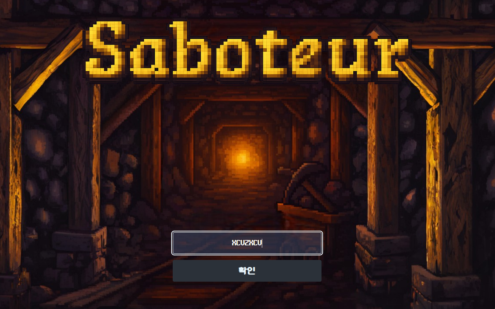
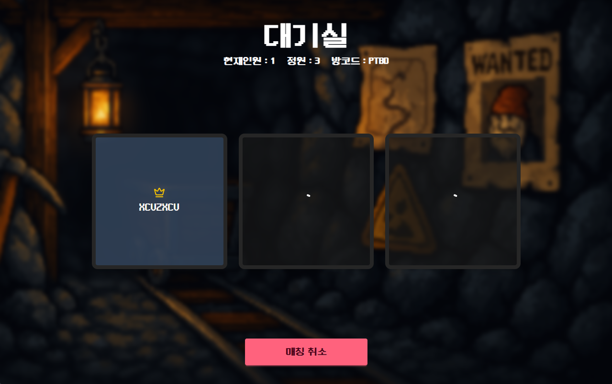
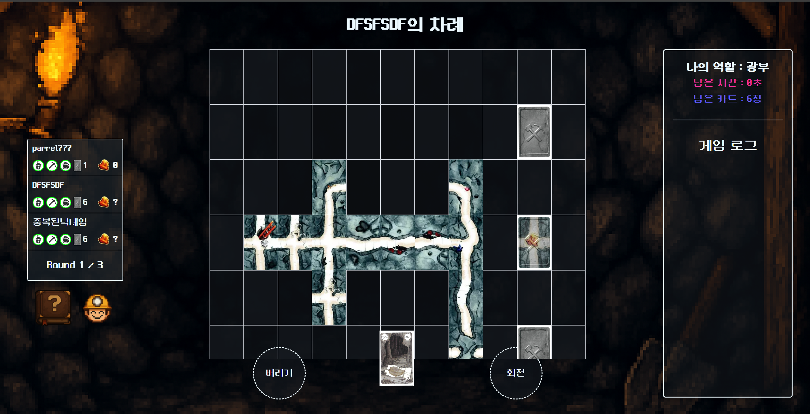

# Path Finder Front-end

보드게임 **"사보타지(Sabotage)"**를 온라인에서 플레이할 수 있도록 구현한 프론트엔드 프로젝트입니다.  
OpenVidu를 기반으로 한 **n:n 음성 채팅**, 실시간 인터랙션, 스토리북 기반 컴포넌트 테스트 환경 등을 갖추고 있습니다.

---

## 🌟 Features

- OpenVidu 기반 n:n 음성 채팅 기능
- 사보타지 룰 기반 턴제 게임 로직
- 실시간 상태 동기화 (WebSocket 기반)
- 반응형 UI 지원

---

## 🧑‍💻 Contributors

|    Name     |
| :---------: |
| Doohyun Kim |
| Hayoung Son |
| Jaehun Kim  |
| Jiwoo Park  |

---

## 🚀 Getting Started

```bash
pnpm install
pnpm run dev
```

> 기본 포트는 `localhost:5173`입니다.

---

## ⚙️ Environment Variables

`.env.example` 파일을 참고하여 `.env` 파일을 구성해주세요.

```
VITE_OPENVIDU_API_BASE_URL=
VITE_OPENVIDU_URL=
VITE_OPENVIDU_SECRET=
VITE_SOCKET_URL=
```

> 변수 정보는 Front Slack 채널을 통해 공유됩니다.

---

## 📁 Project Structure

```
src/
├── components/     # 공통 UI 컴포넌트
├── contexts/       # 전역 상태 관리 (예: React Context)
├── hooks/          # 커스텀 훅
├── layouts/        # 페이지 레이아웃 템플릿
├── libs/           # 유틸리티 및 외부 라이브러리 래퍼
├── pages/          # 라우트 페이지들
├── services/       # API 통신 관련 함수들
│   └── api.ts
├── index.css       # 글로벌 스타일
├── main.tsx        # 앱 진입점
└── vite-env.d.ts   # Vite 환경 타입 정의
```

---

## 🛠️ Tech Stack

| Tool / Library         | Version          | 설명                              |
| ---------------------- | ---------------- | --------------------------------- |
| React / ReactDOM       | ^19.0.0          | 메인 프론트엔드 프레임워크        |
| Vite                   | ^6.2.0           | 번들러 및 개발 서버               |
| pnpm                   | latest           | 패키지 매니저                     |
| TypeScript             | ~5.7.2           | 정적 타입 언어                    |
| Tailwind CSS / DaisyUI | ^4.1.4 / ^5.0.38 | 유틸리티 기반 스타일링 프레임워크 |
| OpenVidu Browser       | ^2.31.0          | WebRTC 기반 n:n 음성 채팅 지원    |
| React Hook Form        | ^7.56.3          | 폼 상태 관리                      |
| React Query            | ^5.74.3          | 서버 상태 비동기 관리             |
| Storybook              | ^8.6.12          | UI 컴포넌트 개발 및 테스트        |
| Vitest / Playwright    | ^3.1.2 / ^1.52.0 | 프론트엔드 테스트 프레임워크      |
| ESLint / Prettier      | ^9.21.0 / ^3.5.3 | 린팅 및 코드 포매팅               |

---

## 📦 Build & Deployment

```bash
pnpm run build
```

- 빌드 결과는 `dist/` 디렉토리에 생성됩니다.
- 배포는 내부 서버 또는 Netlify/Vercel 환경에서 진행 가능합니다.

---

## 🧪 Testing & Documentation

- `Storybook`을 통해 UI 컴포넌트를 시각화 및 테스트합니다.
- `storybook-static/`에 빌드된 정적 스토리북 페이지가 생성됩니다.

```bash
pnpm run storybook
```

---

## 📜 Scripts

| 명령어               | 설명                               |
| -------------------- | ---------------------------------- |
| `pnpm run dev`       | 개발 서버 실행 (`localhost:5173`)  |
| `pnpm run build`     | 정적 파일 빌드 (배포용)            |
| `pnpm run storybook` | 스토리북 실행 (컴포넌트 문서 확인) |
| `pnpm run test`      | 테스트 실행 (`Vitest`)             |
| `pnpm lint`          | ESLint를 통한 코드 린팅            |
| `pnpm format`        | Prettier로 코드 자동 포맷팅        |

---

## 🤝 Contribution

1. `issue` 확인 또는 새 이슈 생성
2. 새로운 브랜치에서 작업
3. 커밋 시 `feat`, `fix`, `chore` 등 prefix 사용
4. PR 생성 후 코드 리뷰 및 병합

---

## 📷 Demo

---

#### Log In Page



---

#### Lobby Page


---

#### Waiting Room Page



---

#### In Game Page



---

## 🔗 Project Links

- [🗂 View the project board on JIRA](https://your-company.atlassian.net/jira/software/projects/PROJECTKEY/boards/1)

- [💬 Join the conversation on Microsoft Teams](https://teams.microsoft.com/l/channel/...)

- [🔗 View the repository on GitHub](https://github.com/SW-PathFinder/Front-end.git)

---

## 📄 License

This project is for internal use only.

---
